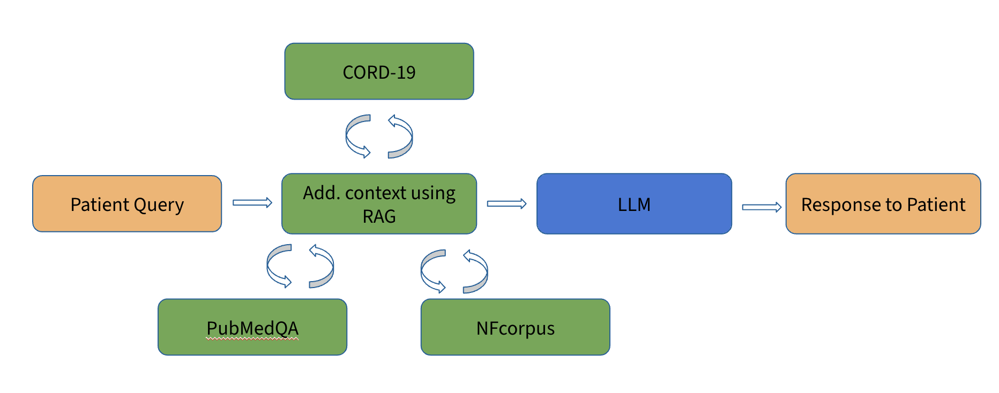

# Med-QnA-App

Cross-Platform seamless chat application that performs CDQA + RAG tailored towards Medical Q&amp;A, Carried out as part
of MED 277, UCSD Fall '23

# Overview

**Medimate:** The Medical Q&A App, is a state-of-the-art solution designed as a Proof of Concept (POC) for providing accurate, context-aware answers to medical-related inquiries. Leveraging the power of OpenAI's GPT and self-hosted Retrieval-Augmented Generation (RAG), it integrates sophisticated language models with a specialized medical knowledge base. This application is not only a baseline for building scalable applications in the healthcare domain but also features a user-friendly interface with speech-to-text capabilities and document upload options. Intended for continuous updates, our goal is to enhance its generalization, scalability, and modularity, making it an easily accessible and reliable resource for patients, healthcare professionals, and anyone seeking medical information.

An overview of implementation is given below. 

## Setup:

1. Have ``git`` installed on your system. In a terminal navigate to a directory to save this project.
2. Do ``git clone git@github.com:shy982/Med-QnA-App.git``.
3. Do ``cd ./Med-QnA-App`` to enter root directory of project.

## Requirements:

1. Running the app on your machine (No dev): Have Docker installed on your Mac/PC: The application is now containerized
   in a docker environment and the deployment file is added in the source directory under `docker-compose.yml`.

2. Developing/testing purposes: If you want to have a development environment you'll need to
   install ``npm``, ``node``, ``Python 3.6+`` and follow the README's of the respective
   directories. ``src/main/marshaler`` has the backend code. ``src/main/ui/web/medi-mate`` has the frontend.

3. Mandatory Requirement: You'll need an `OPENAI_API_KEY` and add that to a .env file. An `env.example` is given in the root directory of the repo. To get the API follow instructions in [OpenAI API](https://openai.com/blog/openai-api)

## Running the application:

To run the application (Production build deployment for demo purpose only, not a dev environment):

1. Navigate to the project root directory in your terminal.
2. Run ``docker-compose up``.
3. Wait a while for frontend and backend containers to spawn.
4. Go to http://localhost:3000/ to start chatting

## Repository Handling Notes:

1. Raise PR on separate branch for code updates & request code owner review.
2. Read env.example to create .env for API tokens.
3. Mark TODO's as issues.

## Collaboration: 

We appreciate any ideas and contributions from the fellow open-source community. We aim to make this application accessible and modularized enough to use as a plug-and-play model for Evidence-based medicine & Closed Domain Question Answering. 

Please feel free to contact the authors if you are interested to contribute or collaborate: 

[Shyam Renjith](https://www.github.com/shy982)
[Sanidhya Singal](https://www.github.com/sayhitosandy)
Hyrum Eddington